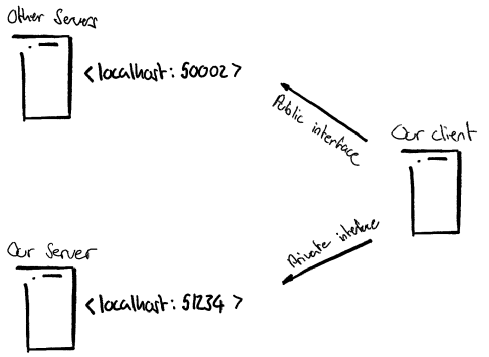

# ToDo-Server

## Important Note
> Our server listens at port 51234. This is important because **our** client identifies **our** server over this port.
> This is due to our client supporting features, that are **not** supported by the defined standard (e.g.: setting categories).
> Our client therefore checks on application startup, to which port he got connected. If the client connected to a server
> listening on port 51234, it recognizes that it connected to our client and is therefore able to fully take advantage of
> the supported features. If the client connects to port 50002 however, we disable these features to stay compliant to the
> defined standard. Therefore, if you want to connect other clients to our server, please use port 51234. If you want to
> connect our client to other servers, please change the port (as explained below) to the port the server is listening on.
>  
>  
> 

## How to change the target server IP & Port
> You can find the target server IP the client connects to inside the ClientNetworkPlugin class.
> Hence, if you want the IP the client connects to, you must update the given field inside the ClientNetworkPlugin.

## Adding the SQLite-JDBC driver in IntelliJ
1. Open the project in IntelliJ
2. On the top left, click on **File** and select **Project Structure** (File -> Project Structure)
3. Move to the **Libraries**-tab and click on the **+** (plus) icon to add a new project library.
4. Select **Java** and navigate to the **lib-directory** of this project. The lib-directory is located inside the
   src-directory.
5. Select the **sqlite-jdbc-3.36.0.3.jar** and click on **add**.
6. Click on **apply** and close the window. You're able to use the jdbc-sqlite driver now.

## Adding the SQLite-JDBC driver in Eclipse
1. Open the project in Eclipse
2. Click with the right side of the mouse on yout project
3. Click on Build Path
4. Click on Configure Build Path
5. Make sure you are in the Java Build Path Folder
6. Click on Modulepath
7. Then Add JARs...
8. Open this path: ToDo-Server/scr/lib
9. Click on the jar file and apply with "ok"
10. Click on Apply and Close You're able to use the jdbc-sqlite driver now.

## Features
### Server-Side features
- [x] User input validation
- [x] User account management
- [x] User passwords are stored hashed
- [x] Database names are hashed since they contain identifying information
- [x] Store information in SQLite database
- [x] Messaging Protocol was implemented as described
- [x] Server upgraded to handle (optional) categorization of items
- [x] Data load happens threaded in the background, not blocking the UI
- [x] Server runs robust, any call not described in the messaging protocol simply returns Result|false
- [x] Tokens have a 60 minutes time to live & are somewhat robust against the [Birthday Problem](https://en.wikipedia.org/wiki/Birthday_problem)

### Client-Side features
- [x] Messaging Protocol was implemented as described
- [x] Graphic user interface
- [x] Client recognizes if connected to own server or not and adjusts functionality accordingly
- [x] MVC which supports all API features 
- [x] Show and hide passwords
- [x] Validation for passwords
- [x] How-To Tutorial
- [x] Focus-Timer (Pomodoro)
- [x] Charting
- [x] Categories (only with the associated server)
- [x] Search function
- [x] ToDo-item filter (all and today)

## How to connect to your server via powershell
1. Let the ServerRunner run
2. Open up Powershell (type Poweshell in the Windows Searchbar)
3. Type **ipconfig** in Powershell
4. At the bottom of the result, it returns **IPv4 Address**. This is your IP-address - copy it
5. Type **test-netconnection IPADDRESS -port 51234** (check "Important Note"). Change IPADDRESS to your IP-address that you copied from the last step.
6. The console from the ServerRunner should give you an output. test-netconnection sends a TCP-packet to your server.

## Contributors
- [Margareta Karaqi](https://github.com/mkfhnw)
- [Nico Sträuli](https://github.com/nicSt12)
- [Joel Läubin](https://github.com/Joel-Laeubin) / [MadMowgli](https://github.com/MadMowgli/MadMowgli)
